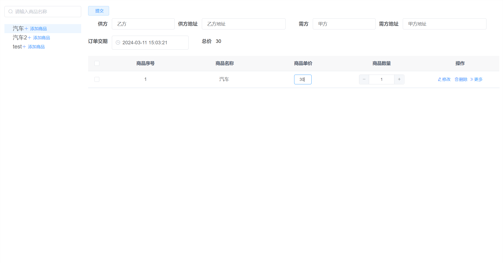
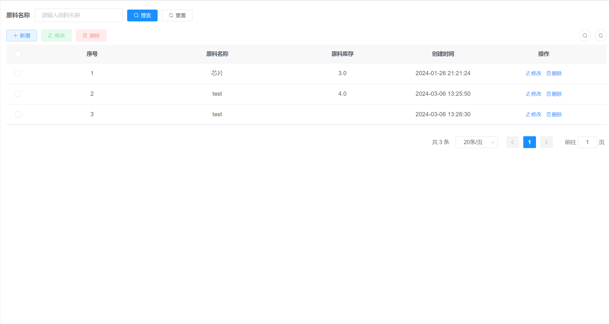
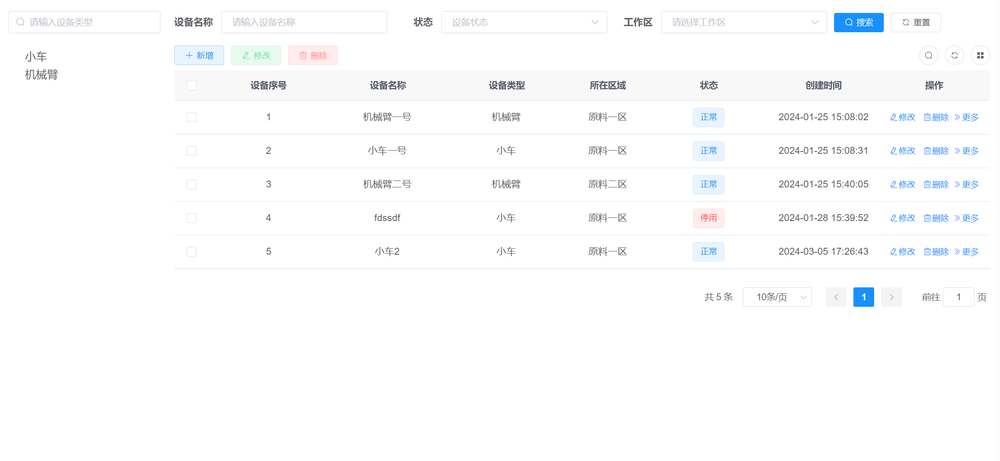
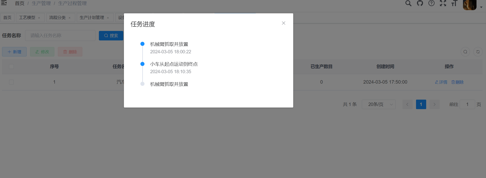
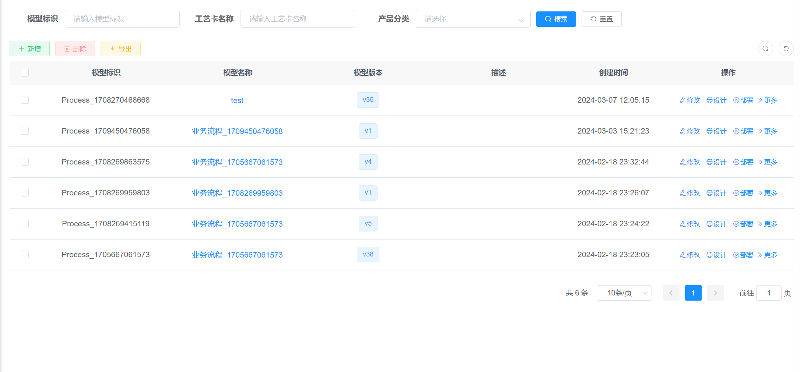
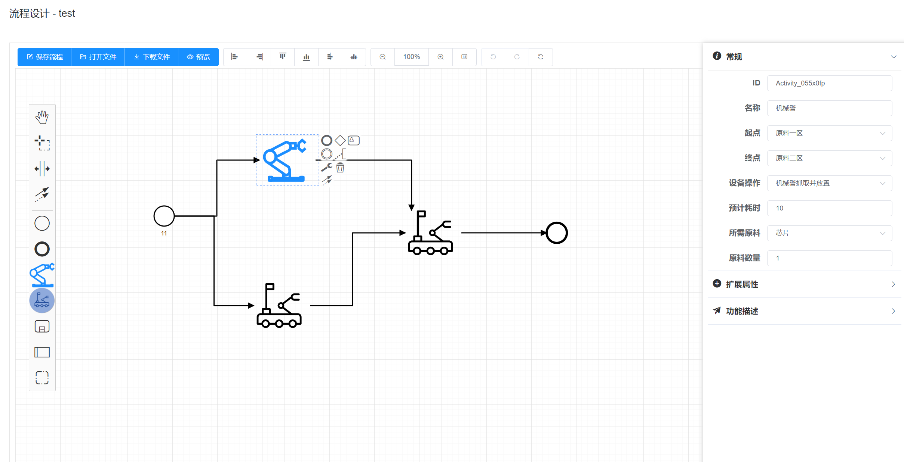
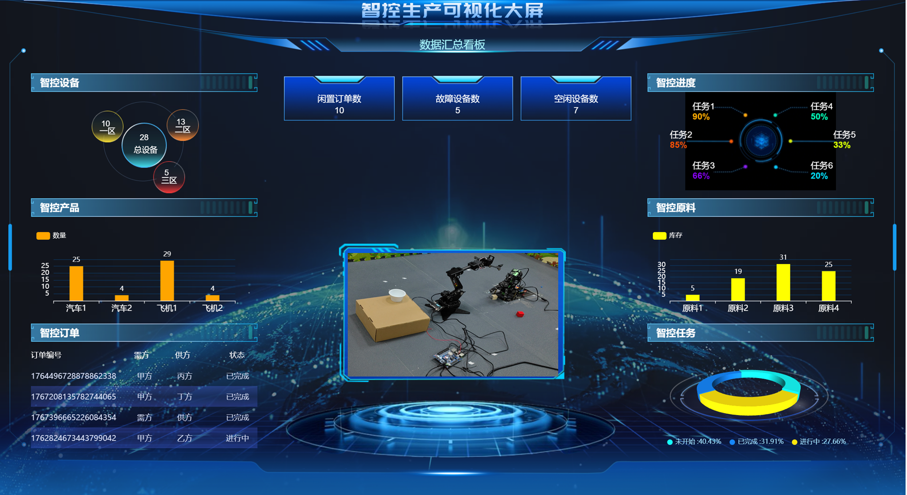
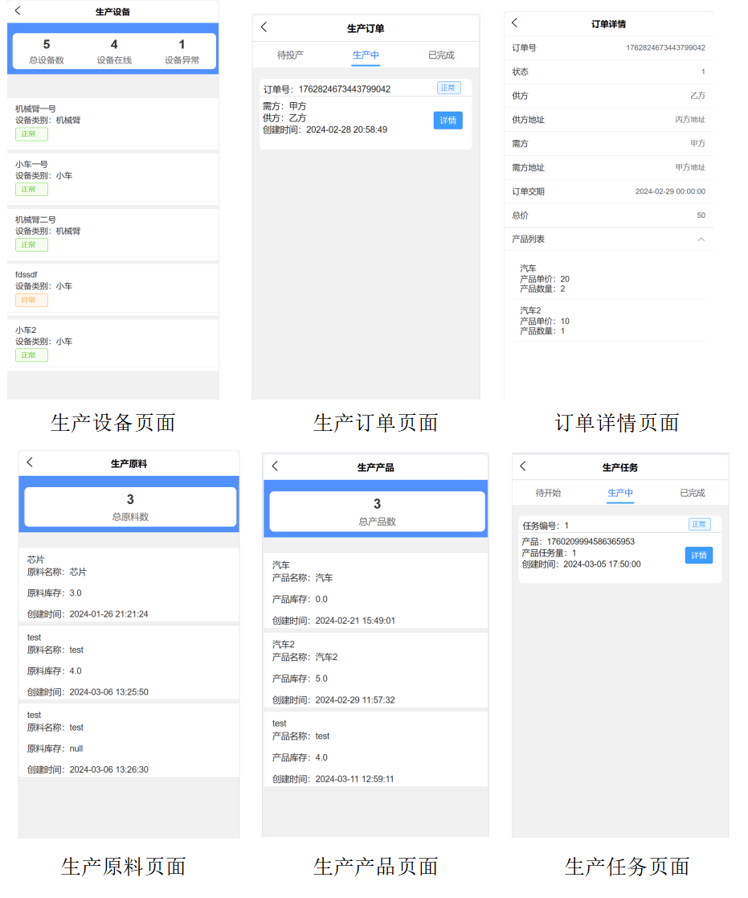

# 智控生产前端系统 (基于Ruoyi-flowable框架)

## 功能概览
① **订单管理**：录入和维护客户对产品的需求，包括产品种类、规格、数量、交期等信息  
② **库存管理**：提供简单的生产所需物料出库管理及成品入库管理  
③ **生产计划管理**：根据订单生成并管理生产任务  
④ **工艺卡管理**：创建工艺流程，设置操作参数和顺序，形成拓扑图结构  
⑤ **排产管理**：实现设备能力计算、任务管理和生产过程跟踪  
⑥ **计算模型管理**：确保整个生产过程的优化和智能化，核心在于时间调度算法模型、路径规划模型和机械臂动作规划模型三部分  
⑦ **设备管理**：实现对设备信息的全方面管理，包括设备信息维护、设备注册管理、设备续约管理、设备运行监测、设备功能集管理五个核心功能。

## Web前端：Vue3, javascript, elementplus
## uniapp前端：Vue3, javascript, elementplus
## 界面展示
### 订单界面
<figure>
  
</figure>

### 工业原料
<figure>
  
</figure>

### 工业设备
<figure>
  
</figure>

### 工业任务
<figure>
  
</figure>

### 工艺模型
<figure>
  
</figure>

### 工艺卡图形化界面
<figure>
  
</figure>

### 数据大屏
<figure>
  
</figure>

### UniAPP部分界面
<figure>
  
</figure>
